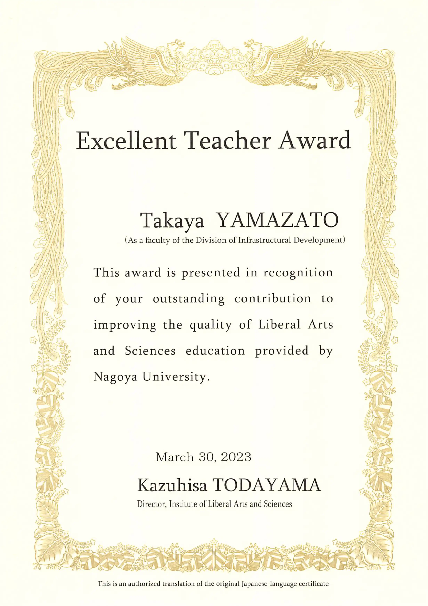

The Nagoya University Liberal arts and Sciences (NU-ILAS) Excellent Teacher Award aims to improve and enhance the quality of liberal arts and sciences education at our university by recognizing faculty members who have achieved outstanding performance in educational and operational activities related to liberal arts and sciences education, or who have achieved excellent academic results through creative and innovative initiatives.

The award was given for the faculty members' lecture support during the COVID-19 pandemic.
All members of the Infrastructure Development Division for Liberal Arts Education were recognized.
Professor Yamazato is the head of the division.

Details of the support we provided are available on the websites of the Institute for Liberal Arts and Sciences and Academic Central.

- [Nagoya University Liberal arts and Sciences](https://www.ilas.nagoya-u.ac.jp/en/covid-19.html)
- [Academic Central](https://ac.thers.ac.jp/tags/online-lecture/)

In addition, all staff members who worked in the office of the Institute for Liberal Arts Education were awarded a special commendation by the ILAS Directore, Prof. Todayama.
How wonderful it is! Truly, Professor Todayama is amazing!

- Award recipients: All staff members who worked in the office of the Institute for Liberal Arts Education since fiscal year 2017
- Reason for the award: Maintenance and improvement of educational activities during the COVID-19 pandemic and introduction of new curriculum for general education courses
- Date of the award ceremony: March 30, 2023
- Method of the award: Presentation of commendation certificates
