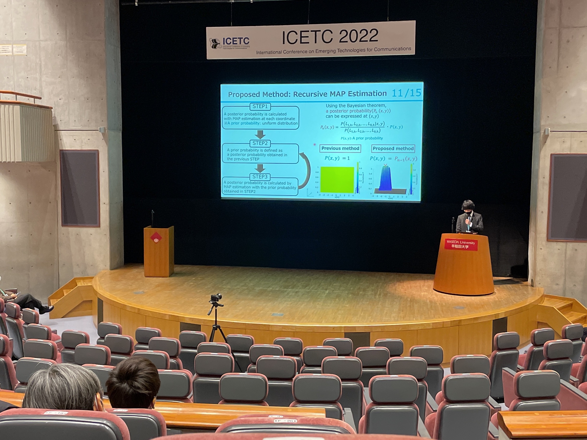

-----

山里研の江原です．

2022/11/29-12/1 で開催されたICETC2022で発表するため，東京に出張しました．

初の学会が国際会議ということで緊張しましたが，自分の研究テーマに近い発表を聴くことができ、良い刺激を受けました．
また，日ごろから研究内容についてお世話になっている各大学の先生に挨拶することができ，有意義な3日間を過ごすことができました．

-----

山里研の服部です.

