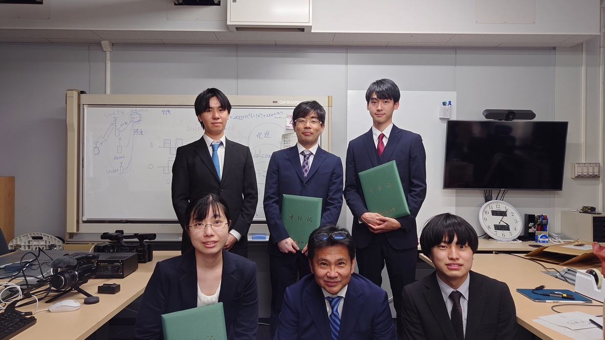

山里研究室からも 5 名の方が卒業・修了されました．

おめでとうございます！

皆さんが山里研卒業生の第一期生になります．素晴らしいですね．
今後のご活躍を祈念しております．
これからも遠慮無く研究室に遊びに来て下さいね．

コロナで研究室イベントができなかったですが，来年からは元に戻す予定です．
もし都合がつくようであれば，飲み会や研究室旅行などの研究室の楽しいイベントにも参加してもらえると嬉しいです．

ところで，杉山総長の祝辞で ChatGPT にふれたこともあり，僕も研究室の卒業生へのお祝いのメッセージを ChatGPT で作ってみました．

> 尊敬する研究室の卒業生の皆様へ、
>
> おめでとうございます！この素晴らしい成果を達成したことを、心から祝福いたします。
>
> 研究室での長い時間、熱心な努力と忍耐力を持って研究を進めてこられましたこと、心から敬意を表します。今後も、この精神を忘れず、新しい分野に挑戦していただけることを期待しています。
>
> 卒業生の皆様が将来の人生で、自分たちの能力を最大限に発揮し、より高い目標を達成できるように、心から応援しています。また、研究室にとっても、卒業生の皆様が輝かしい活躍をしてくれることを楽しみにしています。
>
> 卒業生の皆様にとって、健康と幸福が常に同伴することを願い、改めておめでとうございます！

さて，どうなんでしょうね．何だかヘタな英語の直訳っぽいのでダメダメな印象ですが，来年にはもっとまともになるのか？
