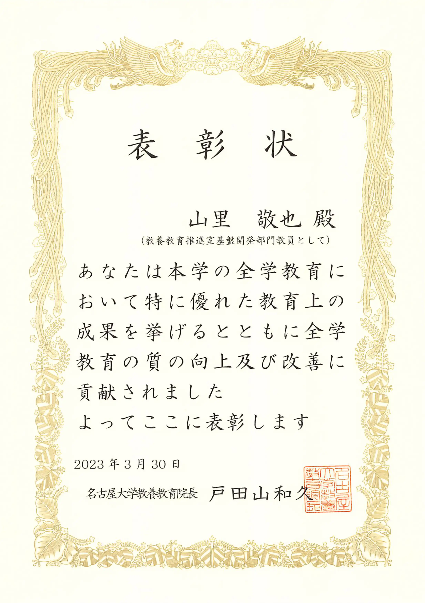

名古屋大学教養教育院全学教育担当教員顕彰は、本学の全学教育における教育活動及び運営活動について優れた業績を挙げた教員や、又は創意工夫に溢れる取り組みにより優れた教育上の成果を挙げた教員を顕彰することにより、本学の全学教育の質の向上及び改善を図ることを目的として行っています。

受賞理由はコロナ禍における講義支援です．教養教育推進箇基盤開発部門の教員全員が受賞しました．
山里教授は同部門の部門長です．

我々が実施した支援内容については教養教育院 HP およびアカデミック・セントラル HP に掲載しています．

- [教養教育院](https://www.ilas.nagoya-u.ac.jp/covid-19.html)
- [アカデミック・セントラル](https://ac.thers.ac.jp/tags/online-lecture/)

また，戸田山院長より教養教育院事務室に在籍したすべての職員に対して，院長特別表彰が授与されました．
とても素敵なことです，さすが戸田山先生！

- 表彰対象：2017 年度以降、教養教育院事務室に在席したすべての職員
- 表彰事由：コロナ禍における教育活動の維持・改善及び全学教育科目新カリキュラム導入
- 表彰日時：2023 年 3 月 30 日
- 表彰方法：表彰状授与
