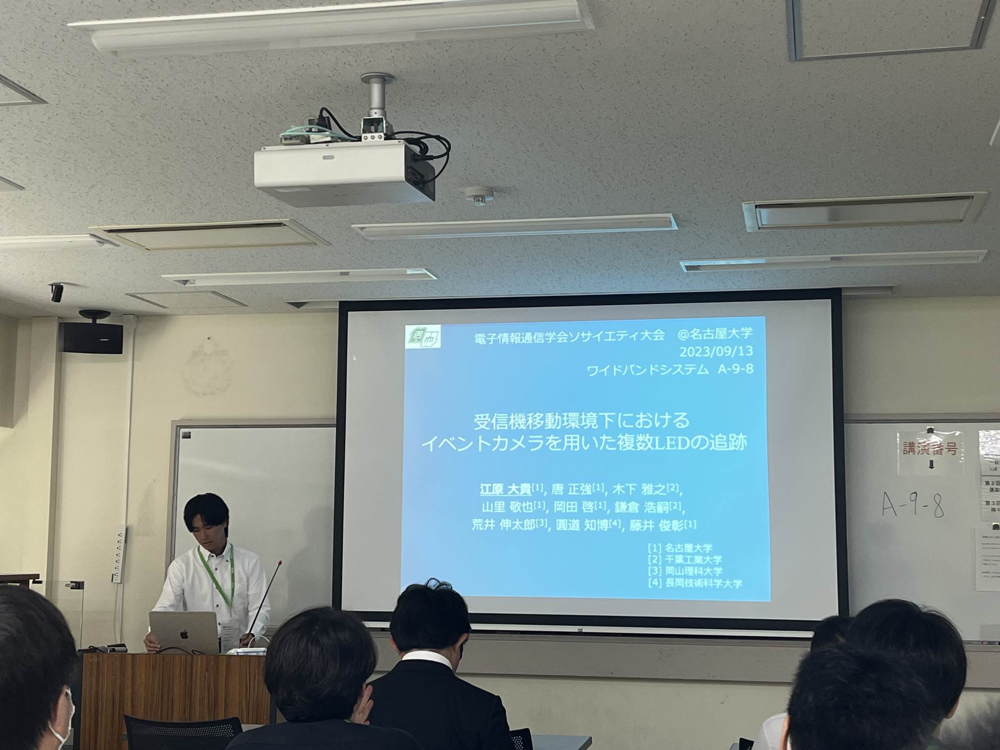

---

名古屋大学で開催された2023年ソサイエティ大会で山里研メンバーが研究発表を行いました。
D3のルイさん、唐くん、M2の小鹿くん、江原くん、鄭くん、M1の曹さんが発表しました。
ソサイエティ大会本大会は山里先生が実行委員長を務められ、非常に多くの参加者が集まりました。懇親会が旧名古屋銀行本店跡で行われ、他大学の先生方および学生さんと活発に交流ができました。
山里研メンバーも発表、交流、聴講を通し通信分野の研究についてより理解を深めることができました。
山里研究室では積極的に学会発表、論文投稿を行なっています。

