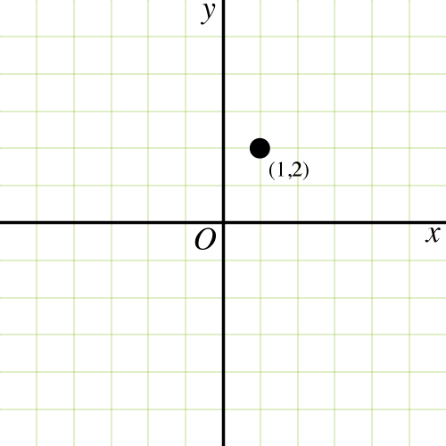
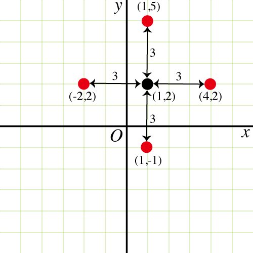
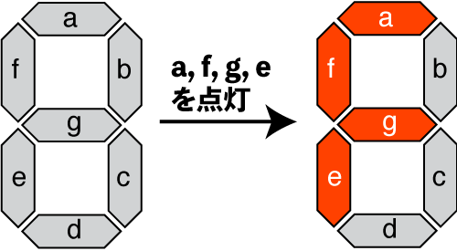
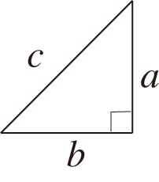
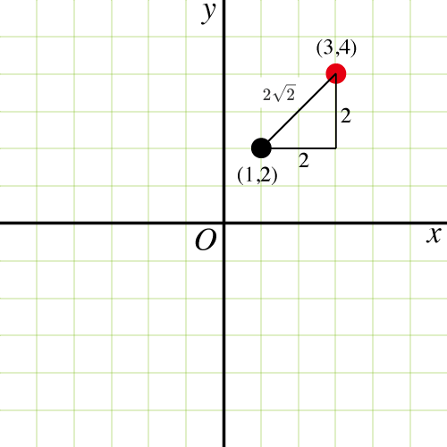
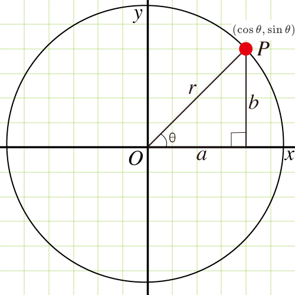

本日のWWLセミナー「Python でフラクタルを描画しよう」は開催します．
先ほど三小田先生より連絡があり，本日のWWLセミナーは開催することになりました．参加者の皆さんは名大附属高校までお越し下さい．

台風の影響で落雷，大雨の予報となっております．

どうぞ気をつけてお越し下さい．

---

参加者の皆様，

お疲れ様でした．今日のセミナーは如何でしたか？

時間切れのため，宿題として出した「各自のイニシャルをタートルグラフィックスで描く」，ぜひトライしてみてください．

さて，今日のセミナーの冒頭でも話ましたように，明日は[東海地区に台風が上陸](https://www.jma.go.jp/bosai/map.html#7/30.935/140.01/&elem=root&typhoon=all&contents=typhoon)する恐れがあります．
暴風警報が出た場合には対面でのセミナーは中止し，オンラインに切り替えて実施します．

実施の可否については，三小田先生から明日の 6:30 にメールにて連絡しますので，確認してください．

オンラインの場合，Zoom にて実施します．

Zoom とコラボの 2 つを同時に利用できるようにしておいてください．
たとえば，Zoom はスマートフォンあるいはタブレット端末．コラボは PC など端末が 2 つあると便利です．
もちろん PC 1 台で Zoom とブラウザ（Chrome など）を同時に立ち上げてもらっても問題ありません．

とは言え，今日のように対面でやるのがベストなので，てるてる坊主を軒下にかけておきましょう．

それでは，明日もよろしくお願いします．

山里

---

- 担当：山里敬也　（名古屋大学 教養教育院，工学研究科 情報・通信工学専攻）
- 日時：8 月 12 日（金）、13 日（土）　 10：30 ～ 12：00、13：00 ～ 14：30
- 講義場所：教育学部附属中・高等学校　交流ホール

> ## 重要（事前準備）　<!-- omit in toc -->
>
> この講義では [Google Colaboratory](https://colab.research.google.com/) (コラボと呼びます) を使います．
>
> - コラボの利⽤には [Google アカウント](https://support.google.com/accounts/answer/27441?hl=ja)が必要です．事前に取得しておいてください．
> - コラボは PC のブラウザから利⽤できます．⾃宅からでも OK︕
> - ブラウザは何でも良いと思います．もし，うまくいかないようであれば [Google Chrome](https://www.google.co.jp/chrome/) をダウンロードしてご利⽤ください．
> - コラボの使い方は[こちら](https://sites.google.com/a.ipsj.or.jp/mooc/list/How2)を参照してください．

---

このページでは高大接続探究セミナーの「Python でフラクタルを描画しよう」を希望する高校生の皆様に，事前に知っておいて欲しい内容について書きます．

2022 年度の資料を公開します．

- [2022 年度 1 日目の資料](Turtle_Graphics_Day_One.pdf)

- [2022 年度 2 日目の資料](Turtle_Graphics_Day_Two.pdf)

2021 年度とほぼ同じ内容です．

また，コラボのファイルも公開します．ご自身のコラボにアップロードしてご利用ください．

- [2022 年度 1 日目のコラボファイル](Turtle_Graphics_WWL_One.ipynb)

- [2022 年度 2 日目のコラボファイル](Turtle_Graphics_WWL_Two.ipynb)

以下に目次を示します．

このうち「座標」については中学校で習った内容です．
1 日目の講義でも，座標については利用しますので予め復習しておいてください．

一方「座標と三角関数」は高校で習う内容です．数学 I（三角比）で習いますね．
高校一年生だとまだ習っていないかも知れませんが，ご安心ください．
大丈夫です．難しく無いので，この機会に勉強してみてください．
とりわけ「余弦定理」はいろいろと使えますので，理解しておくと良いです．

逆三角関数は大学で習うものです．これはまだ知らなくても大丈夫です．

2 日目の講義では「関数」の再帰呼び出しについて勉強します．
数学 B（数列）の漸化式が分かるのであれば大丈夫です．
とはいえ，いかにも大学でのプログラミングという内容ですので，難易度は高そうに思われますが，そうでもありません．
コツをつかめば，なんてことありませんので是非チャレンジしてみてください．

---

## 目次　 <!-- omit in toc -->

- [なぜ事前学習が必要なのか](#なぜ事前学習が必要なのか)
- [座標](#座標)
  - [点の移動](#点の移動)
    - [左右への移動](#左右への移動)
    - [上下への移動](#上下への移動)
  - [7 セグメントディスプレイ](#7-セグメントディスプレイ)
  - [長さを求める（三平方の定理）](#長さを求める三平方の定理)
  - [角度を求める（特別な直角三角形）](#角度を求める特別な直角三角形)
  - [14 セグメントディスプレイ](#14-セグメントディスプレイ)
- [座標と三角関数](#座標と三角関数)
  - [余弦定理](#余弦定理)
  - [逆三角関数](#逆三角関数)
- [関数と再帰呼び出し](#関数と再帰呼び出し)
  - [関数](#関数)
  - [代入](#代入)
- [漸化式](#漸化式)
  - [階乗](#階乗)
  - [フィボナッチ数](#フィボナッチ数)

---

## なぜ事前学習が必要なのか

この講義ではプログラミング言語 Python を使い，お絵かきをしていきます．
実際には，タートルグラフィックスというツールを使い「_亀（タートル）_」さんに絵を描いてもらいます．

亀さんに絵を描いてもらうためには，亀さんに以下のようなことを教えてあげる必要があります．

- 画面上のある点まで移動する
- ペンを降ろす（描画開始）
- 指定された方向に向く
- 指定された長さだけ線を描く（描画）
- ペンを持ち上げる（描画終了）

これをプログラムとして記載し，亀さん絵を描いてもらうのです．
このためには，画面上の点を示す座標の基本的な知識と角度（方向）と長さを求めること（実際には図形の一辺として扱います）ができないと
せっかくの講義も*ちんぷんかんぷん*で，ちっとも面白くありません．
とりわけ，[1 日目の講義](Turtle_Graphics_Day_One.pdf)では，亀さんに皆さんのイニシャル（アルファベット）を描いてもらいますが，座標や図形の基本的なことが分からないと何もできないまま終わってしまいます．

以下，簡単に本講義で必要となる座標と図形について説明していきます．
なお，座標と図形の基本的な知識の殆どが，中学校で習ったことですので高校生の皆さんにとっては何も難しくありません．

2 日目の講義では，関数の再帰呼び出しについて学びます．
具体的には，再帰呼び出しを使って[フラクタル](https://ja.wikipedia.org/wiki/%E3%83%95%E3%83%A9%E3%82%AF%E3%82%BF%E3%83%AB)を亀さんに描いてもらいます．

この関数と再帰呼び出しについても，数学的なことについて簡単に説明します．

## 座標

コンピュータでは，画面の位置を「_座標_」として表します．
ここで[座標](https://ja.wikipedia.org/wiki/%E5%BA%A7%E6%A8%99)とは$x$と$y$の組で表される点の位置を表したものです．

中学校で習いましたね．

たとえば$(x,y)=(1,2)$は下図に示す座標（方眼紙）の点として表すことができます．

この図では，原点を$(0,0)$とし，横軸を$x$，縦軸を$y$としています．
$x$軸と$y$軸は原点で垂直に交わります．この$x$軸と$y$軸を座標軸と呼びます．

### 点の移動　

#### 左右への移動

点$(1,2)$を右（$x$軸方向）に長さ 3 だけ移動してみましょう．
そうすると点$(1,2)$は点$(1+3,2)=(4,2)$に移動します．

今後は左（$x$軸方向とは逆）に長さ 3 だけ移動してみましょう．
そうすると点$(1,2)$は点$(1-3,2)=(-2,2)$に移動します．

このように点$(x,y)$が右に長さ$l$だけ移動する場合は座標$x$が$x+l$になり$(x+l,y)$，左に移動する場合は$(x-l,y)$になります．
$y$座標は変わりません．

なお，下図から分かるように 2 点間の長さ$l$は，ただ単に 2 点の$x$座標成分の差の絶対値になります．

#### 上下への移動

点$(1,2)$を上（$y$軸方向）に長さ 3 だけ移動すると点$(1,2+3)=(1,5)$になります．
下に，つまり$y$軸方向とは逆に長さ 3 だけ移動すると点$(1,2)$は点$(1,2-3)=(1,-1)$になります．

このように点$(x,y)$が上に長さ$l$だけ移動する場合は座標$y$が$y+l$になり$(x,y+l)$，下に移動する場合はが$(x,y-l)$になります．
$x$座標は変わりません．

この場合も 2 点間の長さ $l$ は，ただ単に 2 点の$y$座標成分の差の絶対値になります．

### [7 セグメントディスプレイ](https://ja.wikipedia.org/wiki/7%E3%82%BB%E3%82%B0%E3%83%A1%E3%83%B3%E3%83%88%E3%83%87%E3%82%A3%E3%82%B9%E3%83%97%E3%83%AC%E3%82%A4)

[図：ウィキペディアより引用](https://commons.wikimedia.org/wiki/File:7-segments_Indicator.gif)

驚くかもしれませんが，亀さんを上下左右に動かすことで数字の 0〜9，そしてアルファベットの
A, C, E, F, G, H, J, L, O, P, S, U
を描くことができます．
言い換えると，縦の線と横の線の組み合わせで数字とアルファベットの一部を表すことができます．

この仕組みを使ったディスプレイに [7 セグメントディスプレイ](https://ja.wikipedia.org/wiki/7%E3%82%BB%E3%82%B0%E3%83%A1%E3%83%B3%E3%83%88%E3%83%87%E3%82%A3%E3%82%B9%E3%83%97%E3%83%AC%E3%82%A4)があります．

7 セグメントディスプレイでは，7 つの線（セグメントと呼びます）をそれぞれ点灯（あるいは消灯）させることで数字とアルファベットの一部を表現できます．

上の図では，セグメント a, f, g, e を点灯させることでアルファベット「F」を表示しています．

お気づきの方もいるかと思いますが，同じ長さのセグメントを 7 つ，縦横に組み合わせることで数字とアルファベットの一部を表現しています．
なので，つまようじを 7 つ用意して，その組み合わせでもできますね．

興味のある方は，7 つのセグメントのオン（点灯），オフ（消灯）させることで数字の 0〜9，
A, C, E, F, G, H, J, L, O, P, S, U
を表示できることを確かめてみてください．
ぜひ，つまようじ 7 本使って，試してみて下さい．

## 点と点を結んだ線　 <!-- omit in toc -->

### 長さを求める（三平方の定理）

亀さんに線を描いてもらうためには長さを教えてあげる必要があります．
長さはどのように求めれば良いのでしょうか？
縦や横の線の長さを求めるのは簡単ですね．では，斜めの場合は？
より一般的にある点と点を結んだ長さを求めるのはどうすればよいのでしょうか．

点と点を結んだ線の長さを求めるには，中学校で習った三平方の定理（ピタゴラスの定理）を使います．

> 三平方の定理
>
> 直角三角形の斜辺を$c$，他の辺を$a，b$とすると次の関係が成り立つ．
>
> $a^2 + b^2 = c^2$

つまり，

$$
c = \sqrt{a^2 + b^2}
$$

ここで，２つの点の座標を$(x_a, y_a)$，$(x_b, y_b)$とすると，

$$
c = \sqrt{(x_b-x_a)^2 + (y_b-y_a)^2}
$$

となります．

たとえば，点$(1,2)$と$(3,4)$を結んだ線の距離は

$$
\sqrt{(3-1)^2 + (4-2)^2} = \\
\sqrt{2^2 + 2^2} = \sqrt{8} = 2\sqrt{2}
$$

となります．

### 角度を求める（特別な直角三角形）

それでは，亀さんに線を描いてもらう方向を求めるのはどのようにすれば良いのでしょうか．

まずは，中学校でも習った特別な直角三角形を見てみましょう．
そう，三角定規になっている直角二等辺三角形と正三角形を半分にした直角三角形です．

直角二等辺三角形の角度は $45\degree$, $45\degree$, $90\degree$となっており，3 辺の比は $1:1:\sqrt{2}$ です．

もう一つの直角三角形は角度が $30\degree$, $60\degree$, $90\degree$，また，3 辺の比も $1:2:\sqrt{3}$ となります．

上で示した点$(1,2)$と$(3,4)$の場合，1 辺の長さが 2 の直角二等辺三角形になりますので，これら 2 点を結んだ線の角度は 45 度になります．
このように中学校で習った特別な直角三角形を応用することで，$30\degree$, $45\degree$, $60\degree$, $90\degree$の方向については角度と長さを求めることができます．
これらを回転，あるいは拡大・縮小させることでいろいろな線を（図形の一辺として）描くことができます．

### [14 セグメントディスプレイ](https://en.wikipedia.org/wiki/Fourteen-segment_display)

[図：ウィキペディアより引用](https://commons.wikimedia.org/wiki/File:Latin_alphabet_on_a_14_segement_display.gif)

7 セグメントディスプレイでは，一部のアルファベットしか表示できませんでした．
そこで，7 セグメントディスプレイに斜めと間のセグメントを追加して，全ての数字とアルファベットを表示できるようにしたのが[14 セグメントディスプレイ](https://en.wikipedia.org/wiki/Fourteen-segment_display)です．

この例では，a, b, c, d, e, f と m を点灯させることでアルファベット「Q」を表示しています．

なお，ご覧頂くと分かるように直角三角形を組み合わせることで構成されています．
この図ですと $30\degree$, $60\degree$, $90\degree$ の直角三角形（たとえば j, g2, b ）ですが，直角二等辺三角形でも構成することはできます．

## 座標と三角関数

中学校で習った特別な直角三角形を使って求めることができる角度は 30 度，45 度，60 度，90 度です．
では，それ以外の角度の場合の点の座標はどのように求めれば良いのでしょうか．

これも簡単です．三角関数を利用することで求めることができます．

ようやく高校生の数学がでてきましたね．数学 I（三角比）の内容になります．

まずは三角関数の定義から．

点$P$と原点を結ぶ PO の長さを$r$とし，$x$軸方向の長さを$a$, $y$軸方向の長さを$b$とする直角三角形を考えます．
角度$\theta$は$x$軸と PO のなす角度です．このとき，正弦，余弦，正接は次式で与えられます．

- 正弦（サイン，sin）

$$
 \sin{\theta} = \frac{b}{r}
$$

- 余弦（コサイン，cos）

$$
 \cos{\theta} = \frac{a}{r}
$$

- 正接（タンジェント，tan）

$$
 \tan{\theta} = \frac{b}{a}
$$

これより点 P の座標は

$$
 P(a, b) = ( r \cos{\theta}, r \sin{\theta})
$$

になります（上の図を参照してください）．

ここで単位円（$r=1$）で考えると正弦（サイン）と余弦（コサイン）はとても簡単になります．

$$
 \sin{\theta} = b
$$

$$
 \cos{\theta} = a
$$

正接（タンジェント）も，サイン，コサインで表すことができます．

$$
 \tan{\theta} = \frac{\sin{\theta}}{\cos{\theta}}
$$

先に示した特別な直角三角形の場合，正弦（サイン）と余弦（コサイン）は次のとおりです．

| $\theta$      | $0\degree$ | $30\degree$          | $45\degree$          | $60\degree$          | $90\degree$ | $120\degree$         | $135\degree$         | $150\degree$         | $180\degree$ |
| ------------- | ---------- | -------------------- | -------------------- | -------------------- | ----------- | -------------------- | -------------------- | -------------------- | ------------ |
| $\sin \theta$ | 0          | $\frac{1}{2}$        | $\frac{1}{\sqrt{2}}$ | $\frac{3}{\sqrt{2}}$ | 1           | $\frac{3}{\sqrt{2}}$ | $\frac{1}{\sqrt{2}}$ | $\frac{1}{2}$        | 0            |
| $\cos \theta$ | 1          | $\frac{\sqrt{3}}{2}$ | $\frac{1}{\sqrt{2}}$ | $\frac{1}{2}$        | 0           | $\frac{1}{2}$        | $\frac{1}{\sqrt{2}}$ | $\frac{\sqrt{3}}{2}$ | 1            |

### [余弦定理](https://ja.wikipedia.org/wiki/%E4%BD%99%E5%BC%A6%E5%AE%9A%E7%90%86)

直角三角形の場合，先にみたようにピタゴラスの定理が成り立ちますので，一辺の長さを求めることができました．
これを拡張して直角三角形で無い場合でも一辺の長さを求めることができるのが[余弦定理](https://ja.wikipedia.org/wiki/%E4%BD%99%E5%BC%A6%E5%AE%9A%E7%90%86)です．
一般化されたピタゴラスの定理ともいえます．

[図：ウィキペディアより引用](https://en.wikipedia.org/wiki/Law_of_cosines#/media/File:Triangle_with_notations_2.svg)

上の図のように $\triangle ABC$ において、$a = BC$, $b = CA$, $c = AB$, $\alpha = \angle CAB$, $\beta = \angle ABC$, $\gamma = \angle BCA$ としたとき

$$
a^2 = b^2 + c^2 -2bc \cos \alpha
$$

$$
b^2 = c^2 + a^2 -2ca \cos \beta \\
$$

$$
c^2 = a^2 + b^2 -2ab \cos \gamma \\
$$

が成り立ちます．

余弦定理を使うことで，任意の角度をもつ三角形の一辺の長さを求めることができます．

なお，直角三角形の場合，つまり$\alpha = 90 \degree$ だと $\cos \alpha = 0$なので，ピタゴラスの定理

$$
a^2 = b^2 + c^2
$$

となります．

### 逆三角関数

さて，2 点間の長さは余弦定理（直角三角形の場合は三平方の定理）で求めることができます．
一方，始点を原点として$x$軸となす角$\theta$は逆三角関数で求めることができます．

逆三角関数は高校数学の範囲ではありません．大学に入ってから勉強します．
逆三角関数は，任意の三角比から角度を求めることができるため，工学，物理学，幾何学などで広く使われます．

逆三角関数はそれぞれ次のように書きます．なお，簡単のため（$r=1$）の場合を示しています．

- arcsine（$\sin \theta$の逆関数）

$$
 \theta = \arcsin b
$$

- arccosine（$\cos \theta$の逆関数）

$$
 \theta = \arccos a
$$

- arctangent（$\tan \theta$の逆関数）

$$
 \theta = \arctan{ \frac{b}{a} }
$$

## 関数と再帰呼び出し

### 関数

まず関数から説明しましょう．

2 つの変数 $x$、$y$について、$x$の値を決めるとそれに応じて$y$の値がただ一つ定まるとき、$y$は$x$の関数である，といいいます．

たとえば，

$$
 y = ax + b，\hskip{1em} y = \cos x
$$

のように，$y$が$x$の一次式で表されるとき、$y$は$x$の 1 次関数です．
ここで，$a, b$は定数です．

同様に，

$$
 y = ax^2 + bx + c
$$

のように，$y$が$x$の 2 次式で表されるとき、$y$は $x$ の 2 次関数であるといいます．
ここでも$a, b, c$は定数です．

$x$ の関数 $y ＝ f(x)$を関数 $f(x)$ といい，たとえば $f(x) = ax^2 + bx + c$ と書きます．

プログラミングでの「関数」も，考え方としては一緒で，関数への入力 $x$ に対して出力 $y$ がただ一つ定まるようにします．
なお，実際には入力の変数，出力の変数は複数あることが多いです．ここでは，簡単のために 1 つの場合で説明しています．

### 代入

$x=a$ のとき関数 $f(x)$ の値を $f(a)$ で表します．
この $x$ に値 $a$ をいれることを代入といいます．

- 例）2 次関数 $f(x)=x^2-1$ に $x=3$ を代入すると $f(3)=8$ になります．

## [漸化式](https://ja.wikipedia.org/wiki/%E6%BC%B8%E5%8C%96%E5%BC%8F)

漸化式とは，ある数列 $\{ a_n \}$があるとき，数列の各項を，前の項を用いて求めることができる式のことをいいます．

たとえば，1 から順に数を足していく場合，数列 $\{ a_n \}$を次式のように書くことができます．

$$
 a_1 = 0 \\
 a_{n+1} = a_n + n \hskip{1em} (n=1, 2, 3, \cdots)
$$

実際に計算してみると，

$$
%  a_1 = 0 \\
 a_2 = a_1 + 1 = 0 + 1 = 1 \\
 a_3 = a_2 + 2 = 1 + 2 = 3 \\
 a_4 = a_3 + 3 = 3 + 3 = 6 \\
 a_5 = a_4 + 4 = 6 + 4 = 10 \\
 \dots
$$

になり $a_n$ がただ一つ定まります．

ここで，$a_2$ は $a_1$ から計算され，$a_3$ は $a_2$ から計算され，．．．$a_{n+1}$ は $a_n$ から計算されることに気づくかと思います．つまり，前の計算結果を用いて次の値を計算しています．このような計算の仕方を「再帰」もしくは「再帰呼び出し」といいます．

プログラミング言語では，ある関数を「再帰」的に使うことで，プログラムを効率的に書くことができます．
たとえば，階乗の計算や（漸化式で表すことができる）フィボナッチ数の計算を「再帰」を使うことで簡単に書くことができます．

2 日目の講義では，この再帰呼び出しについて学びます．
具体的には，再帰呼び出しを使って[フラクタル](https://ja.wikipedia.org/wiki/%E3%83%95%E3%83%A9%E3%82%AF%E3%82%BF%E3%83%AB)を亀さんに描いてもらいます．

以下，簡単に階乗とフィボナッチ数について説明します．

<!-- 具体的には，階乗とフィボナッチ数が漸化式で表すことができることを示します． -->

### [階乗](https://ja.wikipedia.org/wiki/%E9%9A%8E%E4%B9%97)

$n$ の階乗 $n!$ は，$1$ から $n$ までの全ての整数の積です．つまり，

$$
 n! = \sum_{k=1}^n k = n \times (n-1) \times \cdots 3 \times 2 \times 1
$$

これは，次式のように漸化式としても書くことができます．

$$
 n! =
 \begin{cases}
   1,  &\text{if } n=0 \\
   n \times (n-1)!, &\text{if } n>0
 \end{cases}
$$

漸化式ですので，再帰呼び出しで関数自身を呼び出すようにプログラミングすることで，読みやすい簡単なプログラムが作れます．

### [フィボナッチ数](https://ja.wikipedia.org/wiki/%E3%83%95%E3%82%A3%E3%83%9C%E3%83%8A%E3%83%83%E3%83%81%E6%95%B0)

フィボナッチ数列 $F_n$ は次の漸化式で定義されます．

$$
  F_0 = 0, \\
  F_1 = 1, \\
  F_{n+2} = F_n + F_{n+1} \hskip{1em} ( n \ge 0 )
$$

実際に計算してみると

$$
0, 1, 1, 2, 3, 5, 8, 13, 21, 34, 55, \cdots
$$

になります．

フィボナッチ数列が生み出す「らせん」は世界で最も美しい「らせん」と知られています．
たとえば，ひまわりの種はらせん状に並んでおり，その数はフィボナッチ数となります．

また，花びらの数はフィボナッチ数であることが多いです．

