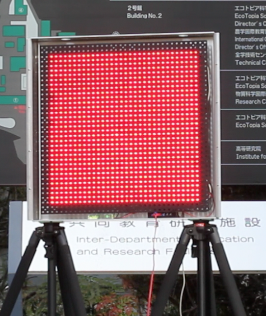
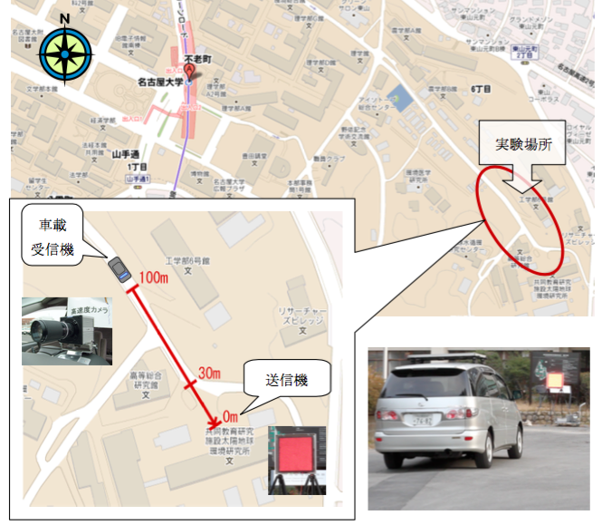

## 新しい情報通信手段として注目を浴びる『可視光通信』

LED は半導体デバイスであるため、人の目には見えないほど高速に点滅させることができます。加えて、受信機として用いる高速度カメラは、通常カメラの約 30 倍、1 秒間に約 1000 枚もの撮影が可能です。この二つの組み合わせにより高速伝送ができ、文字はもとより、音楽や映像などの情報も送ることが可能になります。応用の仕方によって、大きな可能性が広がる分野だと考えています。

我れは可視光通信を交通の分野で発展させる研究を行っています。

## 研究の特徴

可視光通信は様々な活用方法が考えられると思いますが、名古屋大学では、急速に普及しつつある LED 信号機から走行中の車にデータ伝送を行う『路車間可視光通信』の研究に取り組んでいます。LED 信号機に通信機能を加えることで、例えば交差点付近でドライバーからは死角となる『右折待ちの車の影に隠れる直進車の情報』や『横断歩道の歩行者の状況』など、高いところに位置する信号機からなら、車からは見えない道路上の様々な情報を捉えることが可能で、この情報を可視光通信で走行車に送ることで、交通事故の削減にもつながっていくのではと考えています。

## 実験結果

現在の実験では、LED 信号機に見立てた LED アレイ(送信機)＜写真＞の LED1 つ 1 つを 1 秒間に 4000 回点滅させてデータ伝送を行い、車輌に搭載した高速度カメラ(受信機)でそのデータを受信し、同じく車輌に搭載したパソコンでデータを元に戻します。

実験では、車輌が交差点へ近づいていき、信号待ちをする状況を想定していますが、遠距離（100 ｍ付近）では文字情報を、近距離（30 ｍ付近）では文字情報に加えて音声情報も正しく受信することができるようになりました。

## 今後の展開

今後は映像の伝送を可能していきたいと考えています。また信号機だけではなく、車のテールランプからも同時にデータを受信するなど、複数の情報源を同時に受信できることを可能していきたいと思っています。さらには、車から車へ情報を送るマルチホップ伝送にも挑戦していきたいと考えており、これにより、前方の交通事故や渋滞情報を後方車にまで送ることができるようになります。これらのことを可能にするためには、多くの技術的な課題はありますが、不可能ではなく、交通面での安全性向上につながっていく研究だと考えています。

## 可視光通信は海外での注目度も大

可視光通信は 2001 年に慶応大学の中川教授が提唱されたもので、実は日本オリジナルの技術です。にもかかわらず大手電気メーカーが実用化に向け大規模なプロジェクトを動かしているアメリカやヨーロッパなどと比較すると、国内での普及はいまひとつ進んでおらず、とても残念な状況にあります。携帯電話の赤外線受信やテレビのリモコンなど、赤外線を使っている部分はこの可視光通信でも同じことができ、またコスト的にも高価なものではないので、様々な分野での活用を考えることができると思っています。可視光通信の面白いところは、電波のように目に見えないものではなく、光のあたっているところが通信範囲となり、目に見えるものだということ。例えば、店舗の照明に携帯電話を向けると、そのお店のお得な情報を入手できたり、家庭内の照明から生活関連の情報を流すことだって可能です。使い方によって様々な可能性のある可視光通信が、日本の社会にもっと普及されていくことを期待しています。
